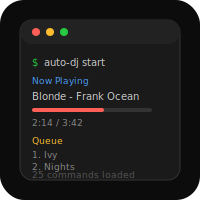

# AppleScripts


macOS automation toolkit. 16 CLI tools, 2276 LOC. Unified `mac` dispatcher for window management, app control, clipboard, system settings, networking, disk, processes, input devices, keychain, music, and multi-step workflows.

## Install

```bash
./install.sh        # symlinks bin/* to ~/.local/bin
./install.sh --uninstall
```

Bash and zsh tab completions are in `completions/`.

## Usage

Everything goes through the `mac` dispatcher:

```bash
mac music play drake
mac win left Terminal
mac app launch Safari
mac clip copy "hello"
mac sys volume 50
mac net wifi status
mac disk usage /
mac proc top
mac key get github-token
mac input trackpad speed 8
```

Or call tools directly: `musicctl play drake`, `winctl left Terminal`, etc.

## Tools

| Tool | Description |
|------|-------------|
| `mac` | Unified dispatcher -- routes `mac <tool> <cmd>` to the right binary |
| `musicctl` | Apple Music playback, search, queue, playlist management |
| `appctl` | Application launcher and manager |
| `winctl` | Window management via AppleScript (left/right/max/center) |
| `clipctl` | Clipboard manager |
| `finderctl` | Finder and file management via AppleScript |
| `sysctl` | macOS system controls (volume, brightness, dark mode, Do Not Disturb) |
| `diskctl` | Storage management utilities |
| `netctl` | Network utilities (WiFi, IP, speed test) |
| `procctl` | Process management utilities |
| `keyctl` | macOS Keychain get/set/list/delete |
| `inputctl` | Trackpad, mouse, keyboard input settings |
| `mac-status` | One-line system status (battery, WiFi, volume, dark mode) |
| `mac-context` | Save and restore desktop state (open apps, window positions) |
| `macflow` | Workflow engine -- run multi-step automation sequences |
| `auto-dj-daemon` | Background daemon that queues Apple Music tracks by mood/genre |

## Workflows

`macflow` runs multi-step workflows defined as simple text files. 5 built-in workflows in `workflows/`:

- **morning** -- open daily apps, set volume, check status
- **focus** -- close distractions, enable Do Not Disturb, set up workspace
- **present** -- presentation mode setup
- **code** -- dev environment layout
- **wind-down** -- evening routine, lower brightness/volume

```bash
mac flow run morning
macflow list
macflow new my-workflow    # create custom workflow
```

## Roadmap

- [ ] Smart queue (tempo/energy-aware Auto-DJ)
- [ ] Play count analytics dashboard

## License

MIT (c) 2026 Joshua Trommel
